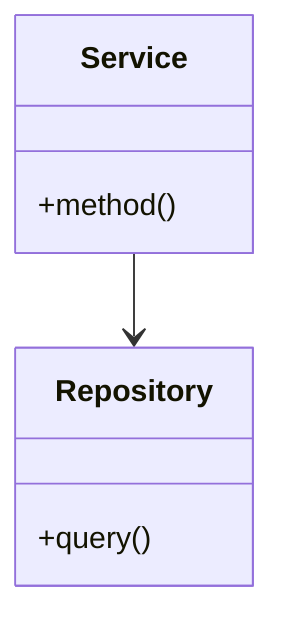

# 代码解释

> 解释代码逻辑、架构设计或技术决策

## 任务

深入解释指定的代码、模块或架构设计，帮助理解其工作原理。

## 解释范围

### 1. 代码级解释

- 函数/方法的功能和逻辑
- 算法实现原理
- 数据结构选择
- 设计模式应用

### 2. 模块级解释

- 模块职责和边界
- 依赖关系
- 接口设计
- 数据流向

### 3. 架构级解释

- 系统整体架构
- 组件交互方式
- 技术选型理由
- 扩展性考虑

## 执行步骤

### 1. 定位目标

根据用户输入确定解释范围：
- 文件路径
- 函数名/类名
- 模块名
- 概念/术语

### 2. 分析代码

- 读取相关代码文件
- 分析依赖和调用关系
- 识别核心逻辑
- 找出关键数据流

### 3. 生成解释

输出格式：

```markdown
## 概述
[一句话总结这段代码/模块的作用]

## 核心功能
[详细解释主要功能]

## 工作流程
1. [步骤 1]
2. [步骤 2]
3. [步骤 3]

## 关键代码解析

### [函数/类名]
\`\`\`python
# 原始代码
\`\`\`

**解释**:
- 第 X 行: [解释]
- 第 Y 行: [解释]

## 数据流
\`\`\`
输入 → 处理 A → 处理 B → 输出
\`\`\`

## 设计决策
| 决策 | 原因 | 替代方案 |
|------|------|----------|
| 使用 X | 因为... | 也可以用 Y |

## 相关文件
- `file1.py`: 依赖此模块
- `file2.py`: 被此模块调用

## 扩展阅读
- [相关文档链接]
```

## 解释级别

### 简要解释（--brief）
- 一段话概述功能
- 列出关键点

### 详细解释（默认）
- 完整的功能描述
- 代码逐行解释
- 设计决策说明

### 深入解释（--deep）
- 历史背景
- 技术原理
- 性能考虑
- 最佳实践

## 示例

```
/explain src/auth/jwt.py
# 解释 JWT 认证模块

/explain UserService 类的 authenticate 方法
# 解释特定方法

/explain 这个项目的整体架构
# 解释系统架构

/explain --brief src/utils/
# 简要解释整个目录

/explain 为什么选择 Redis 而不是 Memcached
# 解释技术决策
```

## 可视化辅助

适时使用图表帮助理解：





------

**最后更新**: 2025-11-30 16:10:35
**维护者**: Documentation Team
**版本**: 1.0.0
