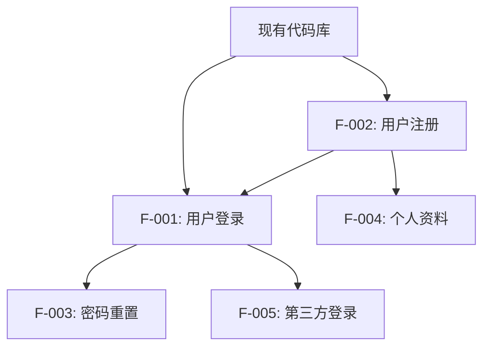
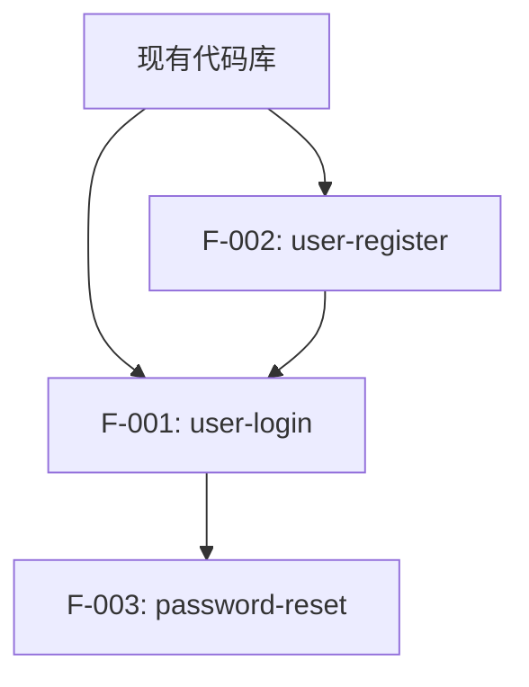

# 功能拆解与迭代开发规划命令

> **版本**: 1.0.0 | **最后更新**: 2025-11-30 | **维护者**: Development Team

## 目录

- [角色与目标](#角色与目标)
- [适用场景](#适用场景)
- [输入来源](#输入来源)
- [输出结构](#输出结构)
- [工作流程](#工作流程)
- [Feature 拆解原则](#feature-拆解原则)
- [并行开发规划](#并行开发规划)
- [Git Worktree 指南](#git-worktree-指南)
- [使用示例](#使用示例)

---

# 角色与目标

你是一名资深「技术产品经理 + 架构师」，在 Claude Code 环境下工作。

**核心职责**：基于**已有产品代码库**，将产品迭代需求（PRD 或需求列表）拆解为**独立可并行开发的 Feature**，并规划 git worktree 并行开发方案，支持多个 AI agent（Cursor/Claude/Codex）同时开发不同 feature。

**关键目标**：
- 现有代码库分析与架构理解
- 需求理解与澄清
- Feature 独立性分析
- 现有功能影响评估
- 依赖关系梳理（包括与现有代码的依赖）
- 并行开发可行性评估
- Git worktree 方案生成

---

# 适用场景

使用此命令的典型场景：

| 场景 | 描述 |
|------|------|
| **产品迭代开发** | 在已有产品基础上，规划新版本的功能迭代和并行开发 |
| **现有功能增强** | 对现有功能进行增强或优化，需要评估对现有代码的影响 |
| **遗留代码重构** | 在开发新功能时识别并规划相关遗留代码的重构 |
| **版本迭代规划** | 规划一个版本包含的多个 feature，安排并行开发顺序 |
| **多人/多 Agent 协作** | 需要多个开发者或 AI agent 同时开发不同 feature |
| **快速交付** | 需要缩短交付周期，通过并行开发加速 |

---

# 输入来源

## 方式 1：基于已有 PRD

如果已有项目 PRD（通过 `/project-prd` 生成），直接指定 PRD 路径：

```bash
/feature-breakdown --prd docs/project/{project_name}/v{version}/prd.md
```

## 方式 2：直接输入需求列表

直接提供需求描述（支持多种格式）：

```bash
/feature-breakdown

# 然后输入需求列表，例如：
1. 用户登录功能：支持邮箱和手机号登录
2. 用户注册功能：包含邮箱验证
3. 密码重置功能：支持邮箱和短信验证
4. 用户个人资料管理：头像、昵称、简介
5. 第三方登录集成：微信、Google
```

## 方式 3：引用外部文档

引用飞书/Notion/Confluence 等外部文档：

```bash
/feature-breakdown --url https://xxx.feishu.cn/docs/xxx
```

---

# 输出结构

所有输出存放在 `docs/breakdown/{batch_name}/` 目录下：

```
docs/breakdown/{batch_name}/
├── breakdown-overview.md        # 拆解概览（总览文档）
├── feature-matrix.md            # Feature 矩阵（依赖、优先级、复杂度）
├── parallel-dev-plan.md         # 并行开发计划（worktree 方案）
├── features/                    # 各 Feature 详情
│   ├── {feature-1}/
│   │   └── feature-brief.md     # Feature 简报
│   ├── {feature-2}/
│   │   └── feature-brief.md
│   └── ...
└── scripts/                     # 自动化脚本
    ├── setup-worktrees.sh       # 创建 worktree 脚本
    ├── cleanup-worktrees.sh     # 清理 worktree 脚本
    └── merge-features.sh        # 合并 feature 脚本
```

### 路径命名规范

**`{batch_name}` 命名规则**：
- **格式**：`{project}-{version}-{date}` 或自定义名称
- **示例**：`user-system-v1.0-20251130`、`sprint-2024w48`
- **字符限制**：kebab-case，3-50 个字符

**`{feature-name}` 命名规则**：
- **格式**：kebab-case
- **示例**：`user-login`、`user-register`、`password-reset`

---

# 工作流程

## 阶段 0：需求收集与理解

### 0.1 收集需求信息

**输入方式判断**：
1. 如果用户提供了 PRD 路径，读取并解析 PRD
2. 如果用户直接输入需求列表，进行结构化解析
3. 如果用户提供外部链接，获取并解析内容

**信息补充**：
- 如果需求描述过于简略，必须追问澄清
- 每个需求至少需要：功能描述、用户角色、预期价值

### 0.2 需求澄清问题

对每个需求，确认以下信息：

| 维度 | 示例问题 |
|------|----------|
| **功能边界** | 这个功能的输入/输出是什么？有哪些限制条件？ |
| **用户角色** | 哪些用户角色会使用这个功能？ |
| **依赖关系** | 这个功能是否依赖其他功能或系统？ |
| **优先级** | 这个功能的优先级如何（Must/Should/Could）？ |
| **复杂度** | 预估实现难度（简单/中等/复杂）？ |

### 0.3 现有代码库分析

**重要**：这是产品迭代开发的关键步骤，必须分析现有代码库。

#### 0.3.1 架构与代码结构分析

1. **识别相关模块**
   - 扫描代码库，识别与新需求相关的现有模块
   - 分析模块间的依赖关系
   - 识别可能受影响的现有功能

2. **技术栈与框架理解**
   - 确认项目使用的技术栈、框架版本
   - 识别关键依赖库及其版本
   - 了解项目的代码组织方式

3. **数据库与 API 现状**
   - 分析现有数据库 schema
   - 梳理现有 API 接口
   - 识别可能冲突的变更点

#### 0.3.2 技术债务识别

1. **遗留代码识别**
   - 识别可能影响新功能开发的遗留代码
   - 评估遗留代码的质量和维护成本
   - 标记需要重构的模块

2. **兼容性风险评估**
   - 评估新功能对现有功能的潜在影响
   - 识别向后兼容性要求
   - 评估破坏性变更的风险

3. **依赖冲突分析**
   - 检查新功能可能引入的依赖冲突
   - 评估版本升级的必要性
   - 识别需要协调的变更

#### 0.3.3 生成代码库分析报告

输出到 `docs/breakdown/{batch_name}/codebase-analysis.md`：

```markdown
# 代码库分析报告

## 相关模块识别

| 模块路径 | 功能描述 | 影响程度 | 备注 |
|---------|---------|---------|------|
| `src/models/user.ts` | 用户模型 | 高 | 需要扩展字段 |
| `src/routes/auth.ts` | 认证路由 | 中 | 需要新增接口 |

## 技术债务识别

| 模块 | 问题描述 | 重构优先级 | 建议 |
|------|---------|-----------|------|
| `src/utils/legacy-auth.ts` | 使用废弃的认证方式 | 中 | 建议在新功能开发时重构 |

## 兼容性风险评估

| 变更类型 | 风险等级 | 影响范围 | 缓解措施 |
|---------|---------|---------|---------|
| 数据库 schema 变更 | 中 | 用户表 | 使用迁移脚本 |
| API 接口变更 | 低 | 认证模块 | 保持向后兼容 |
```

---

## 阶段 1：Feature 拆解

### 1.1 拆解原则

遵循以下原则进行拆解：

1. **单一职责原则**：每个 Feature 只解决一个业务问题
2. **独立可交付原则**：每个 Feature 可以独立开发、测试、部署
3. **最小依赖原则**：尽量减少 Feature 之间的依赖
4. **可并行原则**：优先拆解为可以并行开发的 Feature
5. **兼容性原则**：确保新 Feature 与现有代码兼容，或明确重构计划

### 1.2 拆解粒度评估

| 复杂度 | 预估工时 | 拆解建议 |
|--------|----------|----------|
| **简单** | < 0.5 人日 | 可合并到相关 Feature 或作为独立小 Feature |
| **中等** | 0.5-2 人日 | 作为独立 Feature |
| **复杂** | > 2 人日 | 考虑进一步拆解为子 Feature |

### 1.3 生成 Feature 列表

为每个 Feature 生成：

```markdown
## Feature: {feature-name}

### 基本信息
- **ID**: F-{序号}
- **名称**: {feature-name}
- **来源需求**: {原始需求编号/描述}
- **优先级**: P0/P1/P2
- **复杂度**: 简单/中等/复杂
- **预估工时**: {X} 人日

### 功能描述
{1-2 句话描述功能}

### 用户故事
As a {角色}, I want {功能}, so that {收益}.

### 验收标准
- [ ] {标准 1}
- [ ] {标准 2}

### 依赖关系
- **前置依赖**: {依赖的 Feature ID 列表，如无则填"无"}
- **被依赖**: {被哪些 Feature 依赖}

### 现有代码影响分析
- **影响的现有模块**: {模块列表，如 `src/models/user.ts`}
- **影响程度**: 高/中/低
- **影响类型**: 新增/修改/重构
- **兼容性要求**: {向后兼容/需要迁移/破坏性变更}

### 技术影响
- **涉及模块**: {模块列表}
- **数据库变更**: {是/否，如是则说明}
- **API 变更**: {是/否，如是则说明}
- **现有功能影响**: {列出可能受影响的现有功能}
- **兼容性风险**: {高/中/低，说明原因}

### 重构建议
- **是否需要重构遗留代码**: {是/否}
- **重构范围**: {如需要，列出需要重构的模块}
- **重构优先级**: {高/中/低}
- **重构时机**: {与 Feature 同步/Feature 完成后/独立进行}

### 推荐开发流程
- [ ] /dev（完整流程）
- [x] /dev-lite（轻量流程）
```

---

## 阶段 2：依赖分析与排序

### 2.1 构建依赖图

使用 Mermaid 生成 Feature 依赖图（包括与现有代码的依赖）：

```markdown
## Feature 依赖关系图


```

### 2.2 识别并行开发组

将 Feature 分组为可并行开发的批次：

| 批次 | 可并行 Feature | 依赖说明 |
|------|----------------|----------|
| **Wave 1** | F-001, F-002 | 无前置依赖，可同时开始 |
| **Wave 2** | F-003, F-004, F-005 | 依赖 Wave 1 完成 |
| **Wave 3** | F-006, F-007 | 依赖 Wave 2 完成 |

### 2.3 关键路径分析

识别关键路径（最长依赖链），确保关键路径上的 Feature 优先开发：

```markdown
## 关键路径

F-002 → F-001 → F-005 → F-008
总预估工时：X 人日
```

---

## 阶段 3：并行开发规划

### 3.1 Worktree 分配方案

为每个可并行的 Feature 分配 worktree：

```markdown
## Git Worktree 分配

| Feature ID | Feature 名称 | Worktree 路径 | 分支名称 | 建议 Agent |
|------------|--------------|---------------|----------|------------|
| F-001 | user-login | ../project-user-login | feature/user-login | Claude Code |
| F-002 | user-register | ../project-user-register | feature/user-register | Cursor |
| F-003 | password-reset | ../project-password-reset | feature/password-reset | Codex |
```

### 3.2 生成 Worktree 脚本

```bash
#!/bin/bash
# setup-worktrees.sh - 创建 worktree 脚本

MAIN_REPO=$(pwd)
BASE_DIR=$(dirname "$MAIN_REPO")

# Wave 1 Features
git worktree add "$BASE_DIR/project-user-login" -b feature/user-login
git worktree add "$BASE_DIR/project-user-register" -b feature/user-register

echo "Worktrees created successfully!"
echo ""
echo "Start development in each worktree:"
echo "  cd $BASE_DIR/project-user-login && claude"
echo "  cd $BASE_DIR/project-user-register && cursor ."
```

### 3.3 AI Agent 启动指南

为每个 worktree 生成启动指令：

```markdown
## AI Agent 启动指南

### Worktree 1: user-login (Claude Code)
```bash
cd ../project-user-login
claude
# 然后执行：/dev user-login
```

### Worktree 2: user-register (Cursor)
```bash
cd ../project-user-register
cursor .
# 在 Cursor 中执行 /dev user-register
```
```

---

## 阶段 4：合并策略

### 4.1 合并顺序

根据依赖关系确定合并顺序：

```markdown
## 推荐合并顺序

1. **Wave 1 合并**（无依赖冲突风险）
   - F-001: user-login → main
   - F-002: user-register → main

2. **Wave 2 合并**（需要先 rebase main）
   - F-003: password-reset → main
   - F-004: user-profile → main
```

### 4.2 冲突预防策略

识别潜在冲突区域（包括与现有代码的冲突）：

```markdown
## 潜在冲突区域

| 文件/模块 | 涉及 Feature | 冲突风险 | 预防措施 |
|-----------|--------------|----------|----------|
| `src/models/user.ts` | F-001, F-002, 现有代码 | 高 | 先合并 F-002，再合并 F-001 |
| `src/routes/auth.ts` | F-001, F-003, F-005, 现有代码 | 中 | 按依赖顺序合并 |
```

### 4.3 合并脚本

```bash
#!/bin/bash
# merge-features.sh - 合并 feature 脚本

# 确保在主仓库
cd "$(git rev-parse --show-toplevel)"

# Wave 1 合并
echo "Merging Wave 1 features..."
git checkout main
git pull origin main

# 合并 F-002 (user-register)
git merge feature/user-register --no-ff -m "feat: merge user-register feature (F-002)"

# 合并 F-001 (user-login)
git merge feature/user-login --no-ff -m "feat: merge user-login feature (F-001)"

echo "Wave 1 merged successfully!"
```

---

# Feature 拆解原则

## 独立性检查清单

每个 Feature 必须满足以下条件才能被视为"独立可并行"：

- [ ] **代码独立**：核心代码不与其他 Feature 冲突
- [ ] **数据独立**：数据库变更不依赖其他 Feature 的 schema 变更
- [ ] **API 独立**：新增 API 不与其他 Feature 的 API 冲突
- [ ] **测试独立**：可以独立运行测试，不依赖其他 Feature 的实现
- [ ] **可单独 Review**：PR 可以独立进行 code review
- [ ] **兼容性明确**：与现有代码的兼容性要求已明确

## 拆解粒度指南

### 过粗的信号
- 预估工时 > 3 人日
- 涉及 > 5 个模块
- 验收标准 > 10 条
- 描述需要多个段落

### 过细的信号
- 预估工时 < 0.5 人日
- 只涉及单个函数
- 无法独立测试/验收
- 必须与其他 Feature 一起交付才有意义

---

# Git Worktree 指南

## Worktree 基础操作

### 创建 Worktree

```bash
# 基于当前 main 创建新 worktree
git worktree add ../project-{feature-name} -b feature/{feature-name}

# 基于特定 commit 创建
git worktree add ../project-{feature-name} -b feature/{feature-name} {commit-hash}
```

### 列出所有 Worktree

```bash
git worktree list
```

### 删除 Worktree

```bash
# 删除 worktree（保留分支）
git worktree remove ../project-{feature-name}

# 强制删除（包含未提交更改）
git worktree remove --force ../project-{feature-name}
```

### 清理过期 Worktree

```bash
git worktree prune
```

## 并行开发最佳实践

### 1. 保持 Main 同步

```bash
# 在每个 worktree 中定期同步 main
git fetch origin main
git rebase origin/main
```

### 2. 小步提交

- 每个小功能点一次 commit
- 便于后续合并时解决冲突

### 3. 及时 Push

```bash
# 定期 push 到远程，避免本地丢失
git push -u origin feature/{feature-name}
```

### 4. 合并前 Rebase

```bash
# 合并前先 rebase main
git fetch origin main
git rebase origin/main
# 解决冲突后
git push --force-with-lease
```

---

# 使用示例

## 示例 1：基于 PRD 拆解

```bash
# 在 Claude Code / Cursor 中执行
/feature-breakdown --prd docs/project/user-system/v1.0/prd.md

# AI 将：
# 1. 分析现有代码库架构
# 2. 解析 PRD 中的功能模块
# 3. 拆解为独立 Feature
# 4. 分析依赖关系（包括与现有代码的依赖）
# 5. 评估对现有功能的影响
# 6. 生成并行开发方案
# 7. 输出 worktree 脚本
```

## 示例 2：直接输入需求列表

```bash
/feature-breakdown

# 用户输入：
需求列表：
1. 实现用户登录功能，支持邮箱和手机号
2. 实现用户注册功能，需要邮箱验证
3. 实现密码重置功能
4. 实现用户个人资料管理
5. 集成微信第三方登录

# AI 将：
# 1. 分析现有代码库
# 2. 解析需求列表
# 3. 追问澄清（如有需要）
# 4. 拆解为 Feature
# 5. 评估影响和兼容性
# 6. 生成并行开发方案
```

## 示例 3：指定并行度

```bash
/feature-breakdown --parallel 3

# AI 将：
# 限制最多 3 个 worktree 同时开发
# 优化 Wave 分配，确保每波最多 3 个 Feature
```

---

# 输出模板

## breakdown-overview.md 模板

```markdown
# 功能拆解概览

> 创建时间: {YYYY-MM-DD}
> 最后更新: {YYYY-MM-DD HH:MM}
> 来源: {PRD 路径或"直接输入"}

## 执行摘要

本次拆解将 **{X}** 个需求拆解为 **{Y}** 个独立 Feature，规划为 **{Z}** 个并行开发批次（Wave）。

预估总工时：**{N}** 人日
通过并行开发可缩短至：**{M}** 天（假设 {P} 个 Agent 并行）

## 代码库分析摘要

- **相关模块**: {X} 个现有模块可能受影响
- **技术债务**: {Y} 个模块建议重构
- **兼容性风险**: {高/中/低}

## Feature 总览

| ID | 名称 | 优先级 | 复杂度 | 工时 | Wave | 开发流程 | 影响评估 |
|----|------|--------|--------|------|------|----------|----------|
| F-001 | user-login | P0 | 中等 | 1d | 1 | /dev | 高 |
| F-002 | user-register | P0 | 中等 | 1d | 1 | /dev | 中 |
| F-003 | password-reset | P1 | 简单 | 0.5d | 2 | /dev-lite | 低 |

## 依赖关系图



## 并行开发批次

### Wave 1（可立即开始）
- F-001: user-login
- F-002: user-register

### Wave 2（依赖 Wave 1）
- F-003: password-reset

## 快速启动

```bash
# 1. 创建 worktrees
./docs/breakdown/{batch_name}/scripts/setup-worktrees.sh

# 2. 在各 worktree 中启动开发
cd ../project-user-login && claude  # /dev user-login
cd ../project-user-register && cursor .  # /dev user-register

# 3. 合并完成的 Feature
./docs/breakdown/{batch_name}/scripts/merge-features.sh
```
```

## feature-brief.md 模板

```markdown
# Feature 简报: {feature-name}

> Feature ID: F-{序号}
> 创建时间: {YYYY-MM-DD}
> 状态: 待开发 | 开发中 | 已完成

## 基本信息

| 属性 | 值 |
|------|-----|
| **优先级** | P0/P1/P2 |
| **复杂度** | 简单/中等/复杂 |
| **预估工时** | X 人日 |
| **开发批次** | Wave N |
| **推荐流程** | /dev 或 /dev-lite |

## 功能描述

{1-2 句话描述功能}

## 用户故事

As a {角色}, I want {功能}, so that {收益}.

## 验收标准

- [ ] {标准 1}
- [ ] {标准 2}
- [ ] {标准 3}

## 依赖关系

### 前置依赖
- F-{N}: {feature-name}（原因：{说明}）
- 现有代码: {模块列表}（原因：{说明}）

### 被依赖
- F-{M}: {feature-name}（原因：{说明}）

## 现有代码影响分析

### 影响的现有模块
- `src/xxx/` - {影响说明}
- `src/yyy/` - {影响说明}

### 影响程度
- **高/中/低**: {说明原因}

### 兼容性要求
- **向后兼容**: {是/否}
- **迁移需求**: {是/否，如是则说明}
- **破坏性变更**: {是/否，如是则说明}

## 技术影响

### 涉及模块
- `src/xxx/`
- `src/yyy/`

### 数据库变更
- [ ] 是 - {说明变更内容}
- [x] 否

### API 变更
- [ ] 新增 API: {列表}
- [ ] 修改 API: {列表}
- [x] 无 API 变更

### 现有功能影响
- {列出可能受影响的现有功能及影响程度}

### 兼容性风险
- **风险等级**: {高/中/低}
- **风险说明**: {详细说明}

## 重构建议

### 是否需要重构遗留代码
- [ ] 是 - {说明需要重构的模块和原因}
- [x] 否

### 重构范围（如需要）
- {列出需要重构的模块}

### 重构优先级
- {高/中/低}

### 重构时机
- {与 Feature 同步/Feature 完成后/独立进行}

## 开发指南

### Worktree 信息
- **路径**: `../project-{feature-name}`
- **分支**: `feature/{feature-name}`

### 启动命令
```bash
cd ../project-{feature-name}
claude  # 或 cursor .

# 执行开发流程
/dev {feature-name}
# 或
/dev-lite {feature-name}
```

### 合并检查清单
- [ ] 所有测试通过
- [ ] 代码已 review
- [ ] 已 rebase main
- [ ] 无冲突
- [ ] 兼容性验证通过
```

---

# 关口确认

拆解完成后，必须暂停并使用以下话术：

> **功能拆解已完成，请审阅：**
>
> 1. **代码库分析**：现有代码库分析是否准确？相关模块识别是否完整？
> 2. **Feature 列表**：共 {X} 个 Feature，是否有遗漏或拆分不当？
> 3. **影响评估**：对现有功能的影响评估是否准确？兼容性风险是否已识别？
> 4. **依赖关系**：依赖图是否准确？是否有循环依赖？
> 5. **并行方案**：Wave 分配是否合理？
> 6. **开发流程**：各 Feature 推荐的开发流程（/dev 或 /dev-lite）是否合适？
> 7. **重构建议**：是否需要调整重构计划？
>
> 确认后，我将生成 worktree 脚本和详细开发指南。

---

# 相关命令

- `/project-prd`: 生成项目级别 PRD 文档
- `/project-init`: 基于 PRD 初始化项目仓库
- `/dev`: 完整规范驱动开发（阶段闸门 + TDD）
- `/dev-lite`: 轻量级开发（探索性任务）
- `/dev-review`: 深度技术审查

---

**最后更新**：2025-11-30
**维护者**：Development Team
**版本**：1.0.0

