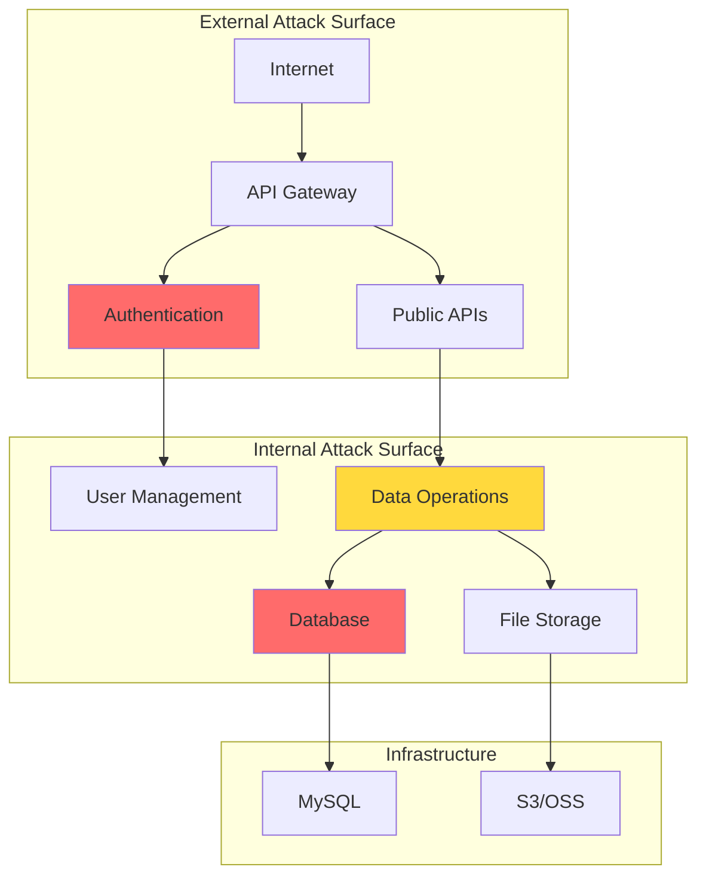

# Threat Model: {{PROJECT_NAME}}

> Generated by Threat Modeler Agent
> Date: {{GENERATED_AT}}
> Source: {{SOURCE_PROFILE}}

---

## Executive Summary

| Metric | Value |
|--------|-------|
| **Total Threats Identified** | {{TOTAL_THREATS}} |
| **P0 (Critical)** | {{P0_COUNT}} |
| **P1 (High)** | {{P1_COUNT}} |
| **P2 (Medium)** | {{P2_COUNT}} |
| **Endpoints Analyzed** | {{ENDPOINTS_ANALYZED}} |
| **Components Analyzed** | {{COMPONENTS_ANALYZED}} |

### Risk Distribution

```
P0 Critical: {{P0_BAR}}
P1 High:     {{P1_BAR}}
P2 Medium:   {{P2_BAR}}
```

---

## Attack Surface Overview



---

## Functional Threat Mapping (Endpoint → Threats)

### Authentication Endpoints

| Endpoint | Method | Threats | Priority | Suggested Agent |
|----------|--------|---------|----------|-----------------|
{{AUTH_ENDPOINT_THREATS}}

### File Operation Endpoints

| Endpoint | Method | Threats | Priority | Suggested Agent |
|----------|--------|---------|----------|-----------------|
{{FILE_ENDPOINT_THREATS}}

### Data Operation Endpoints

| Endpoint | Method | Threats | Priority | Suggested Agent |
|----------|--------|---------|----------|-----------------|
{{DATA_ENDPOINT_THREATS}}

### Admin/Management Endpoints

| Endpoint | Method | Threats | Priority | Suggested Agent |
|----------|--------|---------|----------|-----------------|
{{ADMIN_ENDPOINT_THREATS}}

### Other Endpoints

| Endpoint | Method | Threats | Priority | Suggested Agent |
|----------|--------|---------|----------|-----------------|
{{OTHER_ENDPOINT_THREATS}}

---

## Component Threat Mapping (Asset → Threats)

### Database Components

| Component | Type | Threats | Priority |
|-----------|------|---------|----------|
{{DATABASE_THREATS}}

### Cache/Queue Components

| Component | Type | Threats | Priority |
|-----------|------|---------|----------|
{{CACHE_QUEUE_THREATS}}

### External Services

| Service | Type | Threats | Priority |
|---------|------|---------|----------|
{{EXTERNAL_SERVICE_THREATS}}

---

## Architecture Threat Analysis

### Detected Architecture Patterns

{{ARCHITECTURE_PATTERNS}}

### Architecture-Level Threats

| Pattern | Threat | Description | Check Points |
|---------|--------|-------------|--------------|
{{ARCHITECTURE_THREATS}}

### Framework-Specific Threats

| Framework | Version | Known Threats | Notes |
|-----------|---------|---------------|-------|
{{FRAMEWORK_THREATS}}

---

## Threat Graph

```mermaid
graph LR
    subgraph "Entry Points"
        E1[/login]
        E2[/upload]
        E3[/search]
        E4[/proxy]
    end

    subgraph "Potential Vulnerabilities"
        V1[SQLi]
        V2[File Upload]
        V3[SSRF]
        V4[IDOR]
    end

    subgraph "Impact"
        I1[Data Breach]
        I2[RCE]
        I3[Internal Access]
    end

    E1 --> V1
    E2 --> V2
    E3 --> V1
    E4 --> V3

    V1 --> I1
    V2 --> I2
    V3 --> I3
    V4 --> I1

    style V1 fill:#ff6b6b
    style V2 fill:#ff6b6b
    style V3 fill:#ff6b6b
```

---

## P0 Threats Detail

These threats require immediate attention:

{{#each P0_THREATS}}
### {{id}}: {{name}}

| Property | Value |
|----------|-------|
| **Target** | `{{target}}` |
| **Method** | {{method}} |
| **Type** | {{vulnType}} |
| **Confidence** | {{confidence}} |
| **CWE** | {{cwes}} |

**Reasoning:**
{{reasoning}}

**Check Points:**
{{#each checkPoints}}
- [ ] {{this}}
{{/each}}

**Suggested Agent:** `{{suggestedAgent}}`

---

{{/each}}

## P1 Threats Summary

| ID | Target | Threat | Type | Agent |
|----|--------|--------|------|-------|
{{P1_THREATS_TABLE}}

---

## P2 Threats Summary

| ID | Target | Threat | Type |
|----|--------|--------|------|
{{P2_THREATS_TABLE}}

---

## Recommendations

### Immediate Actions (P0)

{{P0_RECOMMENDATIONS}}

### Short-term Actions (P1)

{{P1_RECOMMENDATIONS}}

### Long-term Improvements (P2)

{{P2_RECOMMENDATIONS}}

---

## Next Steps

Based on this threat model, the recommended workflow is:

1. **Task Planning** - Use `task-planner` to schedule vulnerability detection tasks
2. **P0 First** - Start with critical threats using specialized agents:
{{P0_AGENT_LIST}}
3. **Validation** - Each detected vulnerability should be validated before reporting
4. **Remediation** - Use `remediation-agent` for fix suggestions

---

## Appendix

### CWE References

| CWE | Name | Count |
|-----|------|-------|
{{CWE_REFERENCES}}

### Threat Categories

| Category | Count | Percentage |
|----------|-------|------------|
{{THREAT_CATEGORIES}}

---

*This threat model was generated automatically based on engineering profile analysis.*
*For accurate results, ensure the engineering profile is up-to-date.*
