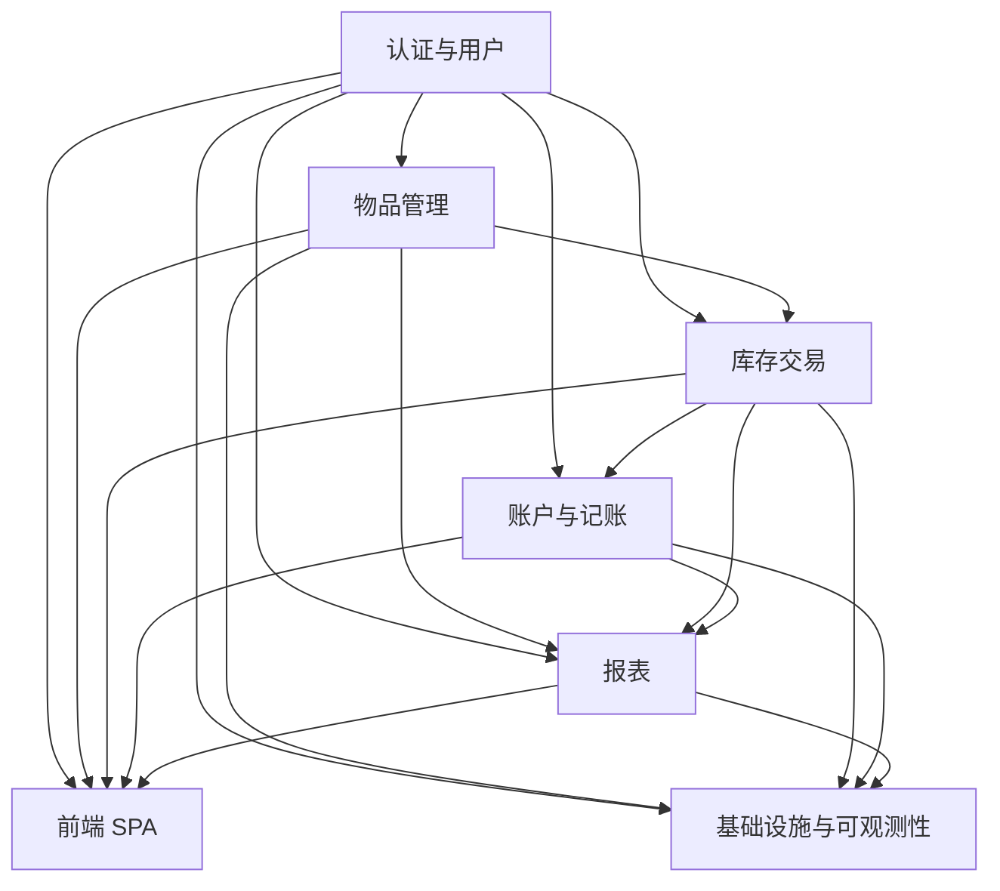
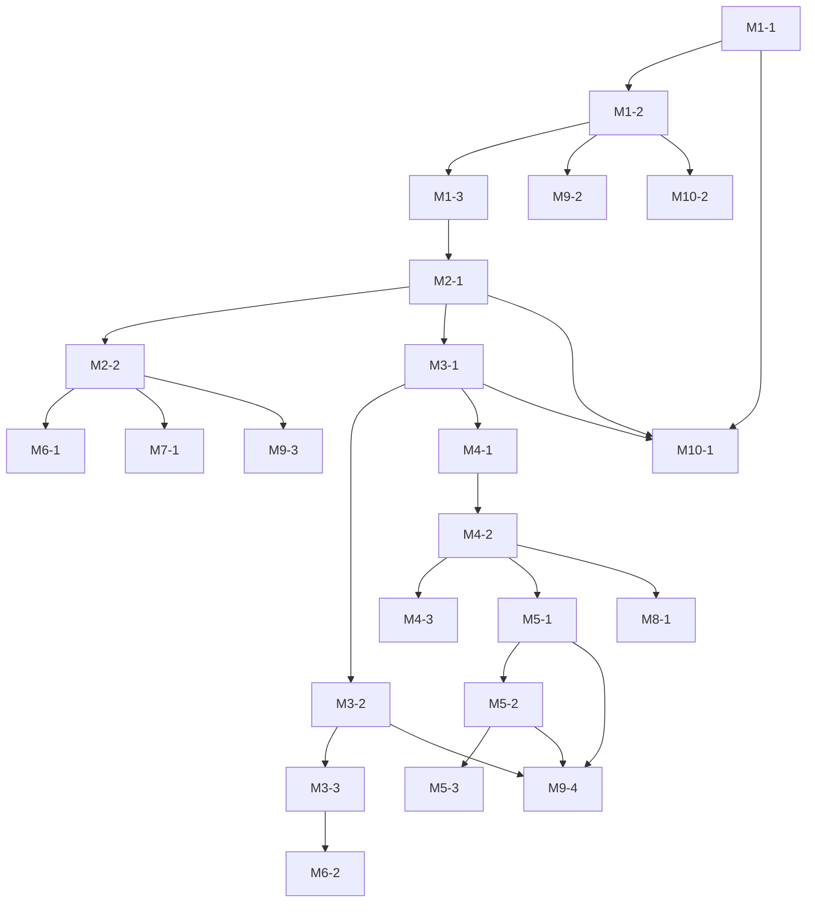

# V1.0 首批开发任务拆解（Inventory Tracking & Accounting）

> 说明：本文件基于 `docs/project/inventory-tracking-accounting/v1.0/architecture.md` 与 `design.md`，只覆盖 **V1.0 / MVP 闭环：入库 → 出库 → 报表** 所需范围。后续 V2.0+ 能力（映射维护、多账户对账、导出等）将另行追加任务。

---

## 1. 任务约定与字段说明

- **任务编号（ID）**：`M{模块序号}-{子任务序号}`，如 `M1-1`  
- **优先级**：`P0`（MVP 必须）、`P1`（强推荐，若有时间）、`P2`（可延期）  
- **阶段划分**：需求 → 设计 → 实现 → 测试  
- **复杂功能预案机制**：  
  - 若任务涉及：新数据模型 / 跨模块 / 外部依赖 / 性能安全 / 估算 > 0.5 人日，则必须先在对应模块文档或 `docs/dev/{feature}/` 下提交预案，评审通过后才能编码  
- **TDD 要求**：  
  - 所有任务默认采用 TDD：先补测试再实现  
  - 测试文件路径需与 `src` 结构镜像，例如：  
    - `backend/src/main/java/.../service/ItemService.java`  
    - `→ backend/src/test/java/.../service/ItemServiceTest.java`  
- **预估工作量**：粗粒度按人日估算，仅用于排期，不做绩效考核依据  

任务表中每个任务结构如下：

- **ID / 名称**
- **模块**
- **任务描述**
- **前置依赖**
- **优先级**
- **阶段划分**
- **是否触发复杂功能预案**
- **是否需要 TDD（默认是）**
- **验收标准**
- **预估工作量（人日）**

---

## 2. 模块与任务总览

### 2.1 模块列表（V1.0）

1. M1：认证与用户（Auth & User）
2. M2：物品管理（Item Management）
3. M3：库存交易（Inventory Transactions）
4. M4：账户与记账（Accounts & Ledger）
5. M5：报表（Reports）
6. M6：搜索与筛选（Search & Filter）
7. M7：文件与图片（Files & Images）
8. M8：设置与映射（Settings & Mapping，V1.0 为内置映射逻辑）
9. M9：前端 Web 应用（Frontend SPA）
10. M10：基础设施与可观测性（Infra & Observability）

### 2.2 任务依赖关系图（Mermaid）

---

## 3. 详细任务列表（按模块）

### 3.1 M1 认证与用户（Auth & User）

#### M1-1 基础用户模型与存储

- **模块**：M1 认证与用户  
- **任务描述**：在 MySQL 中设计并实现 `users` 表（含邮箱/手机号、密码哈希、角色、审计字段），编写对应 JPA 实体、Repository。  
- **前置依赖**：无（可与 Flyway 初始化一起完成）  
- **优先级**：P0  
- **阶段划分**：需求（已在 PRD/设计文档） → 设计（表结构与索引评审） → 实现 → 测试  
- **是否触发复杂功能预案**：否（模型简单、无跨模块强耦合）  
- **是否需要 TDD**：是  
  - 测试路径：`backend/src/test/java/.../repository/UserRepositoryTest.java`  
- **验收标准**：  
  - Flyway 启动无报错，`users` 表成功创建  
  - 可以通过 Repository 完成用户的增删改查单元测试  
- **预估工作量**：0.5 人日  

#### M1-2 基于 JWT 的登录注册流程

- **模块**：M1 认证与用户  
- **任务描述**：实现邮箱/手机号 + 密码注册、登录、登出与令牌刷新；集成 Spring Security 和 JWT；实现 `api/v1/auth/*` 路由。  
- **前置依赖**：M1-1  
- **优先级**：P0  
- **阶段划分**：需求 → 设计（安全与 JWT 策略） → 实现 → 测试  
- **是否触发复杂功能预案**：是（安全、外部依赖：Redis、跨模块影响）  
  - 需在 `docs/dev/auth/` 下编写《认证与权限复杂功能预案》  
- **是否需要 TDD**：是  
  - 测试路径：  
    - 单元测试：`backend/src/test/java/.../security/JwtTokenProviderTest.java`  
    - Web 层测试：`backend/src/test/java/.../controller/AuthControllerTest.java`  
- **验收标准**：  
  - 成功完成注册、登录，返回 JWT  
  - 携带 JWT 的请求才能访问后续受保护 API  
  - 异常情况（密码错误、账号不存在、令牌过期）有明确错误码与信息  
- **预估工作量**：1.5 人日  

#### M1-3 基于用户的多租户数据隔离

- **模块**：M1 认证与用户  
- **任务描述**：在物品、交易、账户等所有与业务相关表上，加上 `user_id` 字段，并在 Repository 查询层面统一按当前用户过滤，实现“用户仅可访问自身数据”。  
- **前置依赖**：M1-1、M1-2（已拿到用户上下文）  
- **优先级**：P0  
- **阶段划分**：设计（数据隔离策略） → 实现 → 测试  
- **是否触发复杂功能预案**：是（新数据模型 + 跨模块 + 安全）  
  - 预案需考虑未来 ADMIN 角色的运维能力  
- **是否需要 TDD**：是  
  - 集成测试：`backend/src/test/java/.../integration/DataIsolationIT.java`  
- **验收标准**：  
  - 不同用户的相同 API 调用不会互相看见对方数据  
  - 尝试使用不同用户 ID 的 JWT 访问资源时，后端返回 404 或 403（按设计文档约定）  
- **预估工作量**：1 人日  

---

### 3.2 M2 物品管理（Item Management）

#### M2-1 物品表结构与实体模型

- **模块**：M2 物品管理  
- **任务描述**：定义 `items` 表（名称、品类、品牌、尺码、颜色、购买价、购买日期、存放位置、状态、软删标记、审计字段等），实现 JPA 实体与 Repository。  
- **前置依赖**：M1-3（user_id 设计一致）  
- **优先级**：P0  
- **阶段划分**：需求 → 设计（字段与索引） → 实现 → 测试  
- **是否触发复杂功能预案**：是（新数据模型）  
- **是否需要 TDD**：是  
  - 测试路径：`backend/src/test/java/.../model/ItemTest.java`、`.../repository/ItemRepositoryTest.java`  
- **验收标准**：  
  - Flyway 迁移成功创建 `items` 表  
  - Repository 能完成基本 CRUD 与软删字段更新  
- **预估工作量**：0.75 人日  

#### M2-2 物品 CRUD REST API（含软删/回收站）

- **模块**：M2 物品管理  
- **任务描述**：实现 `api/v1/items` 的创建、编辑、软删、恢复、分页列表与详情接口，软删进入回收站，支持 30 天内恢复。  
- **前置依赖**：M2-1、M1-2、M1-3  
- **优先级**：P0  
- **阶段划分**：设计（API 规范） → 实现 → 测试  
- **是否触发复杂功能预案**：否（功能清晰、无重度跨模块逻辑）  
- **是否需要 TDD**：是  
  - 控制器测试：`backend/src/test/java/.../controller/ItemControllerTest.java`  
- **验收标准**：  
  - 按 PRD 校验规则（价格≥0、日期格式、必填字段）  
  - 支持软删、恢复操作，回收站列表可查询  
  - 操作审计字段正确填充（创建人/时间、更新人/时间）  
- **预估工作量**：1 人日  

---

### 3.3 M3 库存交易（Inventory Transactions）

#### M3-1 交易模型与表结构

- **模块**：M3 库存交易  
- **任务描述**：定义 `inventory_transactions` 表，支持 IN/OUT/ADJUST 类型，记录关联物品、金额、账户、原因、备注、审计字段等，建立必要索引。  
- **前置依赖**：M2-1、M1-3  
- **优先级**：P0  
- **阶段划分**：需求 → 设计（表结构） → 实现 → 测试  
- **是否触发复杂功能预案**：是（新数据模型 + 未来会与记账紧耦合）  
- **是否需要 TDD**：是  
  - 测试：`backend/src/test/java/.../model/InventoryTransactionTest.java`、`.../repository/InventoryTransactionRepositoryTest.java`  
- **验收标准**：  
  - Flyway 迁移成功创建表  
  - 能支持单件物品一对一 IN 记录，OUT、ADJUST 记录完整  
- **预估工作量**：0.75 人日  

#### M3-2 库存交易写接口（IN/OUT/ADJUST）

- **模块**：M3 库存交易  
- **任务描述**：实现 `api/v1/transactions` 的创建接口，支持 IN / OUT(SELL/DISPOSE/GIFT) / ADJUST，更新物品状态（出库后状态为 REMOVED），并做幂等保护。  
- **前置依赖**：M3-1、M2-2、M1-2  
- **优先级**：P0  
- **阶段划分**：设计（业务规则） → 实现 → 测试  
- **是否触发复杂功能预案**：是（跨模块变更：物品状态 + 记账）  
- **是否需要 TDD**：是  
  - 服务测试：`backend/src/test/java/.../service/InventoryServiceTest.java`  
  - 集成测试：`backend/src/test/java/.../integration/InventoryTransactionIT.java`  
- **验收标准**：  
  - 正常路径：能成功创建各类交易，并更新物品状态  
  - 幂等保护：重复提交同一幂等键时不产生重复记录  
  - 审计字段正确记录  
- **预估工作量**：1.5 人日  

#### M3-3 交易查询与分页

- **模块**：M3 库存交易  
- **任务描述**：实现按物品、时间区间、类型等条件的分页查询接口，为报表与前端列表提供数据。  
- **前置依赖**：M3-2、M6（筛选条件规范可共用）  
- **优先级**：P0  
- **阶段划分**：设计 → 实现 → 测试  
- **是否触发复杂功能预案**：否  
- **是否需要 TDD**：是  
  - 测试：`backend/src/test/java/.../controller/InventoryTransactionControllerTest.java`  
- **验收标准**：  
  - 能依据多条件组合查询  
  - 性能在测试数据规模下 P95 ≤ 300ms  
- **预估工作量**：0.75 人日  

---

### 3.4 M4 账户与记账（Accounts & Ledger）

#### M4-1 账户模型与 CRUD

- **模块**：M4 账户与记账  
- **任务描述**：定义 `accounts` 表（类型：现金/银行卡/平台，名称、备注），实现账户管理 CRUD API。  
- **前置依赖**：M1-3  
- **优先级**：P0  
- **阶段划分**：需求 → 设计 → 实现 → 测试  
- **是否触发复杂功能预案**：是（新数据模型）  
- **是否需要 TDD**：是  
  - 测试：`backend/src/test/java/.../controller/AccountControllerTest.java`  
- **验收标准**：  
  - 账户能增删改查，支持软删或逻辑停用（按设计文档指定）  
  - 与用户隔离逻辑一致  
- **预估工作量**：0.75 人日  

#### M4-2 分录模型与映射规则（V1.0 默认映射）

- **模块**：M4 账户与记账  
- **任务描述**：设计 `ledger_entries` 表，基于固定的 V1.0 默认“品类 → 科目”映射，在代码中内置；实现依据库存交易生成对应分录的服务。  
- **前置依赖**：M3-1、M4-1  
- **优先级**：P0  
- **阶段划分**：设计（会计规则） → 实现 → 测试  
- **是否触发复杂功能预案**：是（新数据模型 + 业务规则）  
- **是否需要 TDD**：是  
  - 测试：`backend/src/test/java/.../service/AccountingServiceTest.java`  
- **验收标准**：  
  - 入库时生成“借：存货/资产，贷：现金/银行”分录  
  - 出库-转售/丢弃/赠与按 PRD 规则生成分录  
  - 金额精度与币种规范正确（Decimal(18,2)，CNY）  
- **预估工作量**：1.5 人日  

#### M4-3 分录查询与汇总接口

- **模块**：M4 账户与记账  
- **任务描述**：实现分录列表与基础汇总接口，支持按账户、时间区间筛选，用于日常核对与报表输入。  
- **前置依赖**：M4-2  
- **优先级**：P1  
- **阶段划分**：设计 → 实现 → 测试  
- **是否触发复杂功能预案**：否  
- **是否需要 TDD**：是  
  - 测试：`backend/src/test/java/.../controller/LedgerEntryControllerTest.java`  
- **验收标准**：  
  - 能按条件分页查询分录  
  - 汇总金额与单笔分录一致（在测试数据集上校验）  
- **预估工作量**：0.75 人日  

---

### 3.5 M5 报表（Reports）

#### M5-1 库存价值报表 API

- **模块**：M5 报表  
- **任务描述**：实现“当前持有物品购买成本汇总”报表 API，支持按品类/品牌分组。  
- **前置依赖**：M2-1、M3-1、M4-2  
- **优先级**：P0  
- **阶段划分**：设计（报表口径） → 实现 → 测试  
- **是否触发复杂功能预案**：是（数据口径与性能）  
- **是否需要 TDD**：是  
  - 测试：`backend/src/test/java/.../service/ReportServiceInventoryValueTest.java`  
- **验收标准**：  
  - 报表计算口径与 PRD 描述一致  
  - 在典型数据量下查询性能达标  
- **预估工作量**：1 人日  

#### M5-2 处置盈亏报表 API

- **模块**：M5 报表  
- **任务描述**：实现“转售收益、丢弃损失”等处置盈亏报表，支持时间区间与分组。  
- **前置依赖**：M3-2、M4-2  
- **优先级**：P0  
- **阶段划分**：设计（盈亏算法） → 实现 → 测试  
- **是否触发复杂功能预案**：是（业务计算 + 性能）  
- **是否需要 TDD**：是  
  - 测试：`backend/src/test/java/.../service/ReportServiceProfitLossTest.java`  
- **验收标准**：  
  - 盈亏计算与设计文档中示例一致  
  - 返回结构适配前端图表需求  
- **预估工作量**：1 人日  

#### M5-3 时间趋势报表 API

- **模块**：M5 报表  
- **任务描述**：实现按月入库金额、出库金额、净额曲线报表 API。  
- **前置依赖**：M3-3、M4-2  
- **优先级**：P1  
- **阶段划分**：设计 → 实现 → 测试  
- **是否触发复杂功能预案**：是（时间聚合 + 性能）  
- **是否需要 TDD**：是  
  - 测试：`backend/src/test/java/.../service/ReportServiceTrendTest.java`  
- **验收标准**：  
  - 能准确按月聚合入库/出库/净额  
  - 接口可灵活支持时间范围参数  
- **预估工作量**：0.75 人日  

---

### 3.6 M6 搜索与筛选（Search & Filter）

#### M6-1 物品搜索与筛选

- **模块**：M6 搜索与筛选  
- **任务描述**：在物品列表接口上实现名称/品牌关键字、品类、时间区间、状态、价格区间筛选与多字段排序。  
- **前置依赖**：M2-2  
- **优先级**：P0  
- **阶段划分**：设计（过滤参数约定） → 实现 → 测试  
- **是否触发复杂功能预案**：否  
- **是否需要 TDD**：是  
  - 测试：`backend/src/test/java/.../controller/ItemSearchControllerTest.java`  
- **验收标准**：  
  - 各过滤条件能组合使用  
  - 按 PRD 要求的字段进行排序  
  - 性能达标（避免明显 N+1 查询）  
- **预估工作量**：0.75 人日  

#### M6-2 交易搜索与筛选

- **模块**：M6 搜索与筛选  
- **任务描述**：在交易列表接口中实现关键字、时间区间、类型等过滤条件。  
- **前置依赖**：M3-3  
- **优先级**：P1  
- **阶段划分**：设计 → 实现 → 测试  
- **是否触发复杂功能预案**：否  
- **是否需要 TDD**：是  
  - 测试：`backend/src/test/java/.../controller/TransactionSearchControllerTest.java`  
- **验收标准**：  
  - 筛选条件正确生效，分页结果稳定  
- **预估工作量**：0.5 人日  

---

### 3.7 M7 文件与图片（Files & Images）

#### M7-1 图片存储与访问接口（本地文件系统）

- **模块**：M7 文件与图片  
- **任务描述**：实现基于本地文件系统的图片上传与访问接口；支持 JPG/PNG/WebP，单张 ≤ 5MB，最多 9 张/物品；前端负责压缩，后端做基础大小校验与限流占位。  
- **前置依赖**：M2-2（物品 ID 与关系）、M1-2（权限）  
- **优先级**：P1  
- **阶段划分**：设计（目录结构与命名策略） → 实现 → 测试  
- **是否触发复杂功能预案**：是（与存储、安全相关）  
- **是否需要 TDD**：是  
  - 测试：`backend/src/test/java/.../controller/FileControllerTest.java`  
- **验收标准**：  
  - 图片上传成功并可通过 URL 访问  
  - 超出大小/数量限制时返回合理错误  
- **预估工作量**：1 人日  

---

### 3.8 M8 设置与映射（Settings & Mapping，V1.0 内置）

#### M8-1 内置品类与科目映射初始化

- **模块**：M8 设置与映射  
- **任务描述**：在应用启动时加载一组默认品类 → 科目映射，用于记账分录生成；暂不提供 UI 配置，仅在代码与配置文件中维护。  
- **前置依赖**：M4-2  
- **优先级**：P1  
- **阶段划分**：设计（映射规则） → 实现 → 测试  
- **是否触发复杂功能预案**：是（对会计规则有影响）  
- **是否需要 TDD**：是  
  - 测试：`backend/src/test/java/.../service/CategoryMappingServiceTest.java`  
- **验收标准**：  
  - 常见品类均有合适的默认科目  
  - 报表与分录都能使用该映射  
- **预估工作量**：0.5 人日  

---

### 3.9 M9 前端 Web 应用（Frontend SPA）

> 前端任务以“页面 + 功能”视角拆分，与后端接口联调前，需要先完成 Mock 数据与组件骨架。

#### M9-1 前端项目初始化与基础布局

- **模块**：M9 前端  
- **任务描述**：基于 React + TypeScript + Vite 创建前端项目，配置 ESLint+Prettier+Vitest，搭建基础路由与布局（顶部导航、侧边菜单或底部 Tab）。  
- **前置依赖**：无（可并行）  
- **优先级**：P0  
- **阶段划分**：设计（全局 UI 结构） → 实现 → 测试  
- **是否触发复杂功能预案**：否  
- **是否需要 TDD**：是  
  - 测试：`frontend/src/__tests__/App.test.tsx`  
- **验收标准**：  
  - 前端项目可启动，基础路由（登录、物品列表、报表）可访问  
  - ESLint/Prettier/测试脚本可正常运行  
- **预估工作量**：1 人日  

#### M9-2 登录与认证前端流程

- **模块**：M9 前端  
- **任务描述**：实现登录页 UI、表单校验，与后端 `auth` API 对接，保存 JWT 于安全位置（例如 HttpOnly Cookie 或前端安全封装），管理登录态与路由守卫。  
- **前置依赖**：M1-2、M9-1  
- **优先级**：P0  
- **阶段划分**：设计（交互与安全策略） → 实现 → 测试  
- **是否触发复杂功能预案**：是（安全与跨端交互）  
- **是否需要 TDD**：是  
  - 测试：`frontend/src/__tests__/LoginPage.test.tsx`  
- **验收标准**：  
  - 正确处理登录成功/失败状态  
  - 未登录访问受保护路由时自动跳转登录页  
- **预估工作量**：1 人日  

#### M9-3 物品列表与详情页

- **模块**：M9 前端  
- **任务描述**：实现物品列表（含搜索、筛选、分页）与详情页 UI，与后端 M2/M6 接口对接。  
- **前置依赖**：M2-2、M6-1、M9-1  
- **优先级**：P0  
- **阶段划分**：设计（信息架构） → 实现 → 测试  
- **是否触发复杂功能预案**：否  
- **是否需要 TDD**：是  
  - 测试：`frontend/src/__tests__/ItemListPage.test.tsx`  
- **验收标准**：  
  - 能完成常规浏览、筛选与跳转详情  
- **预估工作量**：1.5 人日  

#### M9-4 入库/出库录入与报表仪表盘

- **模块**：M9 前端  
- **任务描述**：实现交易录入表单（IN/OUT/ADJUST）以及基础报表仪表盘页面（库存价值、处置盈亏、趋势）。  
- **前置依赖**：M3-2、M5-1、M5-2、M5-3（可部分并行，先 Mock）  
- **优先级**：P0  
- **阶段划分**：设计 → 实现 → 测试  
- **是否触发复杂功能预案**：否（界面侧）  
- **是否需要 TDD**：是  
  - 测试：`frontend/src/__tests__/TransactionForm.test.tsx`、`ReportDashboard.test.tsx`  
- **验收标准**：  
  - 能完成核心闭环的交互：新增物品 → 入库 → 出库 → 查看报表  
- **预估工作量**：2 人日  

---

### 3.10 M10 基础设施与可观测性（Infra & Observability）

#### M10-1 Docker 化与 docker-compose 本地环境

- **模块**：M10 基础设施  
- **任务描述**：编写 `Dockerfile.backend`、`Dockerfile.frontend` 与 `docker-compose.yml`，实现 MySQL+Redis+后端+前端一键启动的本地环境。  
- **前置依赖**：后端可构建（M1~M5 基础结构）、前端可构建（M9-1）  
- **优先级**：P0  
- **阶段划分**：设计（服务拓扑） → 实现 → 测试  
- **是否触发复杂功能预案**：否  
- **是否需要 TDD**：否（以手工验证与后续 CI 替代）  
- **验收标准**：  
  - `docker-compose up` 后，前端可访问并调用后端 API，后端可访问 MySQL/Redis  
- **预估工作量**：1 人日  

#### M10-2 监控与日志基础配置

- **模块**：M10 基础设施  
- **任务描述**：配置 Spring Boot Actuator、Logback JSON 日志，预留 Prometheus/Micrometer 集成点，并在 docs 中说明使用方式。  
- **前置依赖**：后端基本运行（M1 基础）  
- **优先级**：P1  
- **阶段划分**：设计 → 实现 → 测试  
- **是否触发复杂功能预案**：是（可观测性）  
- **是否需要 TDD**：部分（可通过简单集成测试校验健康检查端点）  
- **验收标准**：  
  - `/actuator/health` 与关键健康指标可访问  
  - 日志格式包含时间、级别、追踪 ID 等字段  
- **预估工作量**：0.75 人日  

---

## 4. 任务依赖关系与里程碑规划

### 4.1 任务依赖关系（任务级别示意）

---

### 4.2 里程碑规划

#### 里程碑 1：后端基础域模型与认证打底（MVP 基础） — 约 5 人日

- 覆盖任务：M1-1、M1-2、M1-3、M2-1、M3-1、M4-1  
- 目标：应用能启动，具备用户体系、基础表结构与多租户隔离能力。

#### 里程碑 2：核心业务闭环（入库 → 出库 → 分录） — 约 6 人日

- 覆盖任务：M2-2、M3-2、M4-2、M3-3、M6-1  
- 目标：通过 API 完成入库/出库，自动生成会计分录，并可按条件查询物品与交易。

#### 里程碑 3：报表与前端 MVP — 约 7 人日

- 覆盖任务：M5-1、M5-2、M9-1、M9-2、M9-3、M9-4、M10-1  
- 目标：前端实现登录、物品与交易操作、基础报表可视化，Docker 一键拉起全栈环境。

#### 里程碑 4：增强能力与可观测性 — 约 4 人日

- 覆盖任务：M5-3、M6-2、M7-1、M8-1、M10-2、部分 P1 任务  
- 目标：增强搜索、趋势报表、图片能力与监控日志，为 V2.0 功能打基础。

---

## 5. 说明与后续步骤

1. 后续如需新增功能（如 V2.0 的映射维护、多账户对账、导出 CSV 等），需在 `docs/project/inventory-tracking-accounting/v2.0/` 下新增对应架构与设计文档，再补充新的 `tasks.md`。  
2. 每个任务在进入“实现”阶段前，需确认是否已完成：  
   - 设计文档中的相关章节更新  
   - 若触发复杂功能预案机制，预案已评审通过  
3. TDD 流程为强制要求：**先测后码**，并确保关键路径覆盖率 ≥ 80%。  

